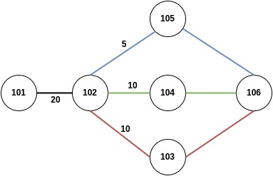

# Task 5 - Partially Disjoint Path-Selection

## Motivation
In our SCION Pathdiscovery project funded by NGI Zero Discovery, we have developed robust concepts for disjoint path selection as a means to avoid shared bottlenecks. We achieve bottleneck avoidance in uploading peers through only using completely disjoint paths. This approach completely ignores partially disjoint paths, which may also lead to performance improvements. We thus extend our disjoint path selection strategy to support also partially disjoint path through exploration. Peers perform "path exploration" by shifting portions of their traffic to alternative paths while monitoring overall throughput, gradually re-distributing traffic to maximize network utilization. 

We expect the proposed extensions to significantly increase the performance of our SCION multipath library by leveraging unused network capacities, since we anticipate different link and router capacities in the Internet. We use the combination of the AS number and the interface number of the Border Router to create unique `Interface IDs`. In our original approach, one Border Router interface with low performance would limit all other interfaces on the path to exactly this performance, since Interface IDs are allowed to be used only one time. With supporting partially-disjoint path, we anticipate to unlock capacities of these (more powerful) Border Router interfaces by using the in other paths, in case these paths contribute additional performance. 

## Path-Selection Design and Implementation
Our partially disjoint path-selection approach is based on two core features: At first, we compute the disjointness of paths by calculating the number of conflicting Interface IDs with all other paths (e.g. paths are disjoint if this number is 0, otherwise they are partially disjoint). We sort the paths based on this computed disjointness. Secondly, we implement a mechanism that measures the overall performance of the currently active pathset (starting with the least disjoint paths) and periodically explores new paths for a subset of all available connections. The performance of all tested pathsets is stored in an in-memory database and if all combinations were tested (or an upper limit of explorations is reached), the implementation chooses the best performing pathset.

The [disjoint](../examples/disjoint/main.go) example shows how to use the partially disjoint path-selection. After creating a `PanSocket` with a known remote socket, a new instance can be obtained via `smp.NewDisjointPathSelectionSocket(remote *PanSocket, numConns, numExploreConns int)`, passing in the PanSocket, a total number of connections the applications uses and how many of these connections are used to explore paths, e.g. `smp.NewDisjointPathSelectionSocket(remote, 3, 1)` would dial over three connections initially, and then use 1 of them to explore new paths. A smaller `numExploreConns` can bring stability into the communication, while increasing the time of finding the optimal pathset for the given number of connections. By providing the same value for `numConns` and `numExploreConns`, all connections will be used to explore new paths. While this may find the optimal pathset within a smaller amount of time, it may lead to highly instable performance while exploring.

Next, the disjoint path-selection should be used with a periodical ticker, to explore a new pathset after a specific time duration. The following code snippet shows how to periodically explore new paths:

```go
go func(dj *smp.DisjointPathselection) {
    metricsTicker := time.NewTicker(1 * time.Second)
    for {
        select {
        case <-metricsTicker.C:
            _, err := disjointSel.UpdatePathSelection()
            if err != nil {
                logrus.Error("[DisjointPathSelection] Failed to update path selection ", err)
                os.Exit(1)
            }
        }
    }

}(disjointSel)
```

After 5 events fired by this ticker, the implementation looks for a new pathset that may be probed and applies it. If there is no new pathset to probe, it will return to the best performing pathset.

To obtain the initial, least disjoint pathset, the application can call `pathset, err := disjointSelection.InitialPathset()`. This pathset is intended to be used to call `Connect(pathset)` to the remote PanSocket.

## Showcase example and first results
To demonstrate performance improvements of our new, partially disjoint path-selection, we run the `disjoint` example in the ASes `101` and `106` in the following topology.



While the topology provides 3 paths between 101 and 106, we set the number of connections to 2. This avoids aggregating all paths, removing the need of path-selection. With our original disjoint pathselection, we observe that a maximum throughput of 10Mbit/s, and in some runs only 5Mbit/s (only one path was used, and depending on the order of paths that SCION returns, also the slowest path was used). With our partially disjoint path-selection, we observe a throughput between 15-20Mbit/s while exploring paths, and a constant throughput of 20Mbit/s after all potential pathsets were probed. With this showcase example, we demonstrate in which scenarios strict disjoint path-selection is limited and how our partially disjoint path-selection overcomes these limitations.
